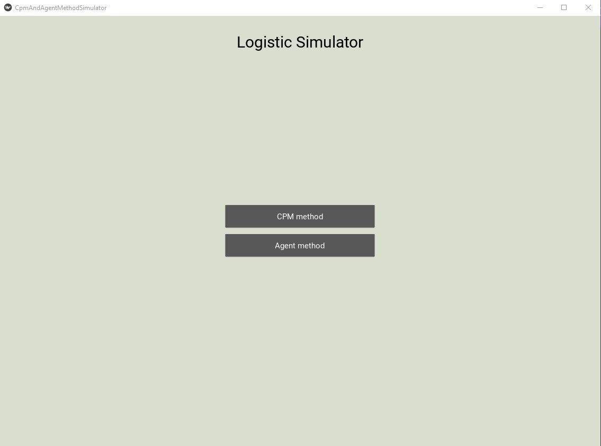
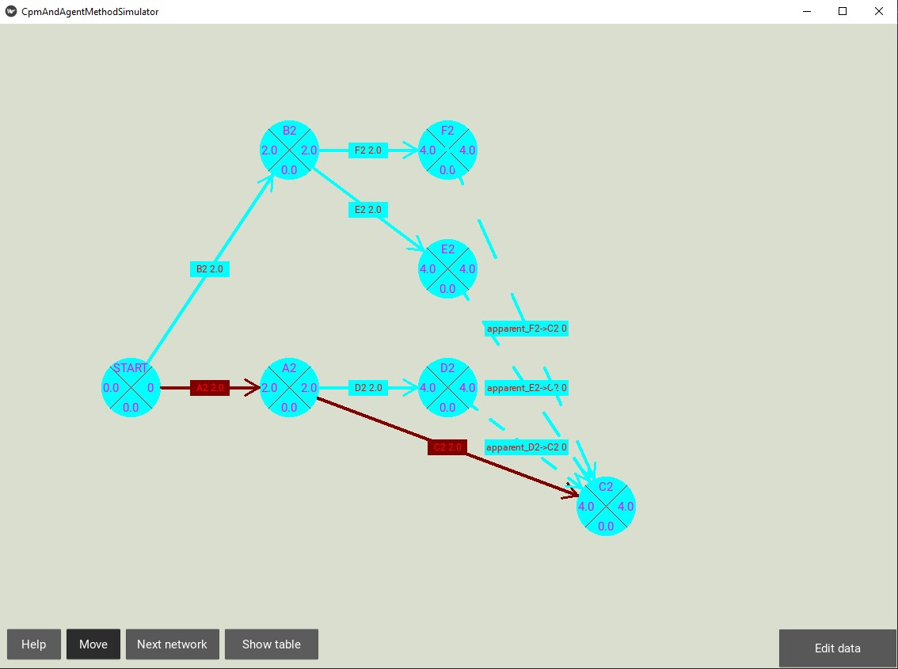
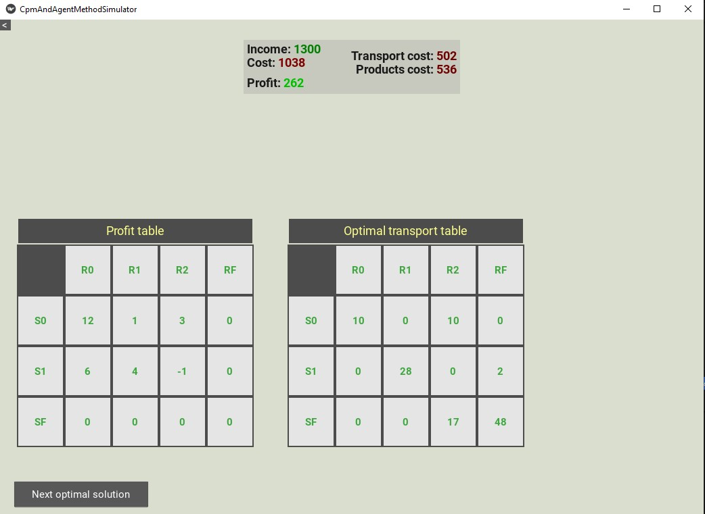

<div align="center">

# 🚀 CPM and Agent Method Simulator

### *Optimize Projects & Supply Chains with Interactive Visualization*


---

</div>

## 📋 About

A powerful Python application that combines two essential optimization algorithms:

- **🎯 Critical Path Method (CPM)** - Advanced project scheduling and management
- **🚛 Agent Method** - Supply chain optimization and transportation problem solving

Built with an intuitive **Kivy-powered GUI** for seamless data input, real-time computation, and stunning visualizations.

---

## Overview

<div align="center">

###  Main Menu


### CPM Network Visualization


### Agent Method Results


</div>

---

## Features

### Critical Path Method (CPM)
- Calculate Early Start (ES) and Early Finish (EF) times
- Calculate Late Start (LS) and Late Finish (LF) times
- Determine activity slack/float (reserves)
- Identify critical activities and critical paths
- Visualize network diagrams with activities, durations, and dependencies
- Generate ASAP (As Soon As Possible) and ALAP (As Late As Possible) schedules
- Support for multiple possible networks and critical paths

### Agent Method (Supply Chain Optimization)
- Solve transportation problems using the agent method
- Calculate optimal transport routes from sellers to buyers
- Compute total costs (products + transportation)
- Calculate total income and profit
- Support for fictional traders/routes when supply/demand is unbalanced
- Visualize results in tabular format

## Project Structure

```
CriticalPathMethod/
├── main.py                  # Main GUI application entry point
├── agent_dev_main.py        # Agent method development/testing script
├── data_input.py            # Data loading utilities
├── cpm/                     # Critical Path Method module
│   ├── solver.py           # CPM algorithm implementation
│   ├── node.py             # Node and activity definitions
│   ├── network/            # Network structure
│   │   └── network.py      # Network graph implementation
│   └── test/               # CPM tests
│       ├── simple_test.py
│       └── test_data/      # Test data files
├── agent/                   # Agent Method module
│   ├── agent.py            # Agent algorithm implementation
│   ├── supply_chain.py     # Supply chain data structures
│   ├── data_loader.py      # Data loading for agent method
│   └── test/               # Agent tests
│       ├── runner.py
│       ├── simple_test.py
│       └── test_data/      # Test data files (JSON)
└── gui/                     # GUI components
    ├── screen_manager.py   # Main screen management
    ├── graph.py            # Graph visualization
    ├── table.py            # Table display
    └── agent_out.py        # Agent results output
```

## Installation

### Prerequisites
- Python 3.7 or higher
- pip (Python package installer)

### Quick Start

**1. Install required packages:**

```powershell
pip install kivy
```

**2. (Optional) Install testing dependencies:**

```powershell
pip install pytest
```

**3. Run the application:**

```powershell
python main.py
```

---

## Usage

### Running the GUI Application

Launch the main application with the interactive graphical interface:

```powershell
python main.py
```

**The GUI provides:**

- **Data input screens** for entering activities, durations, and dependencies
- **Network visualization** showing the CPM graph with critical paths highlighted
- **Results tables** displaying ES, EF, LS, LF, slack, and critical path
- **Schedule views** with ASAP and ALAP schedules

---

### Running Agent Method (Development)

For testing the agent method programmatically:

```powershell
python agent_dev_main.py
```

**Configure supply chain parameters in the file:**

- `supply` - Array of supply amounts for each seller
- `demand` - Array of demand amounts for each buyer  
- `sell_price` - Selling prices per unit
- `buy_price` - Buying prices per unit
- `transport_table` - 2D array of transport costs
- `force_fictional` - Whether to force fictional traders

---

### Running Tests

**CPM Tests:**

```powershell
pytest cpm/test/simple_test.py
```

**Agent Method Tests:**

```powershell
pytest agent/test/simple_test.py
```

---

## Input Data Formats

### CPM Data Format

Text files with structured sections (see `cpm/test_data/` for examples):

```text
STHUNIQUE_ACTIVITIES
activity_id; predecessors; duration

# Example:
A; ; 2
B; A; 3
C; A; 4
D; B,C; 1
```

**Format Explanation:**
- `activity_id` - Unique identifier for the activity
- `predecessors` - Comma-separated list of activities that must complete first (empty for start activities)
- `duration` - Time required to complete the activity

---

### Agent Method Data Format

JSON files with supply chain data (see `agent/test_data/` for examples):

```json
{
  "supply": [10, 20],
  "demand": [15, 15],
  "sell_price": [5, 6],
  "buy_price": [10, 12],
  "transport_table": [[1, 2], [3, 1]],
  "force_fictional": false
}
```

**Format Explanation:**
- `supply` - Available units from each seller
- `demand` - Required units for each buyer
- `sell_price` - Cost per unit from each seller
- `buy_price` - Revenue per unit to each buyer
- `transport_table` - Matrix of transportation costs [seller][buyer]
- `force_fictional` - Force use of fictional traders if needed

---
